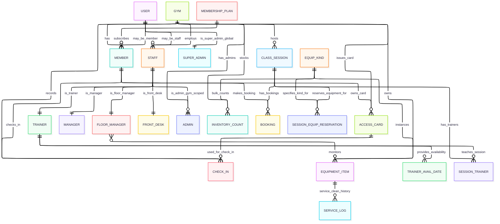
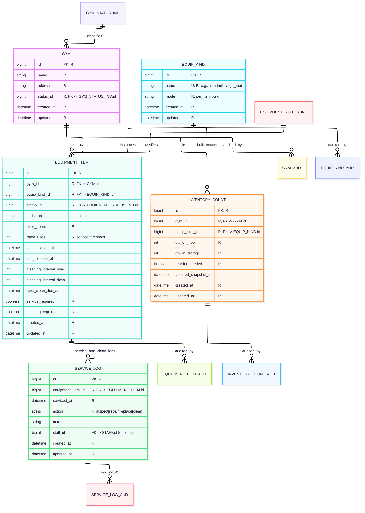
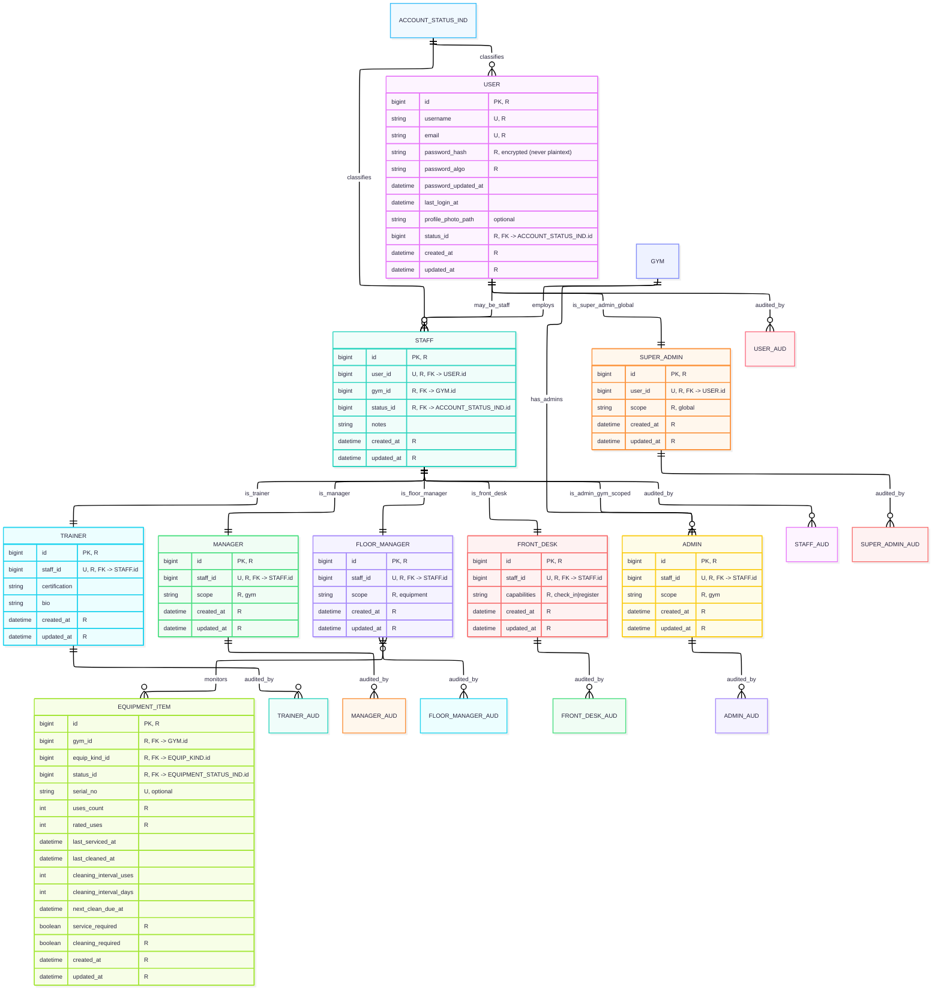
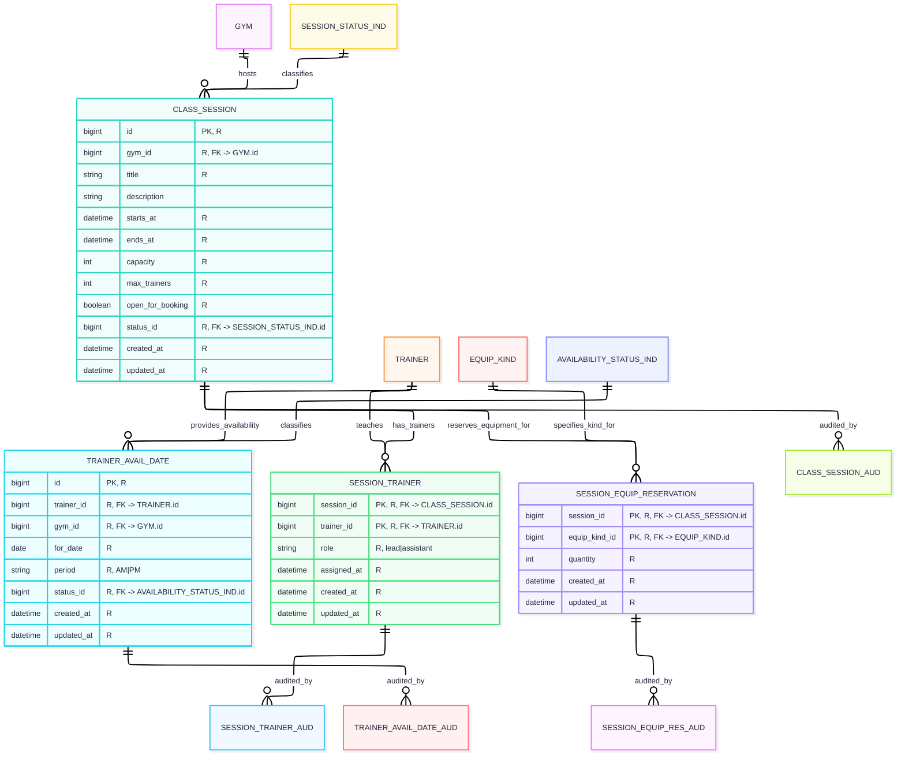
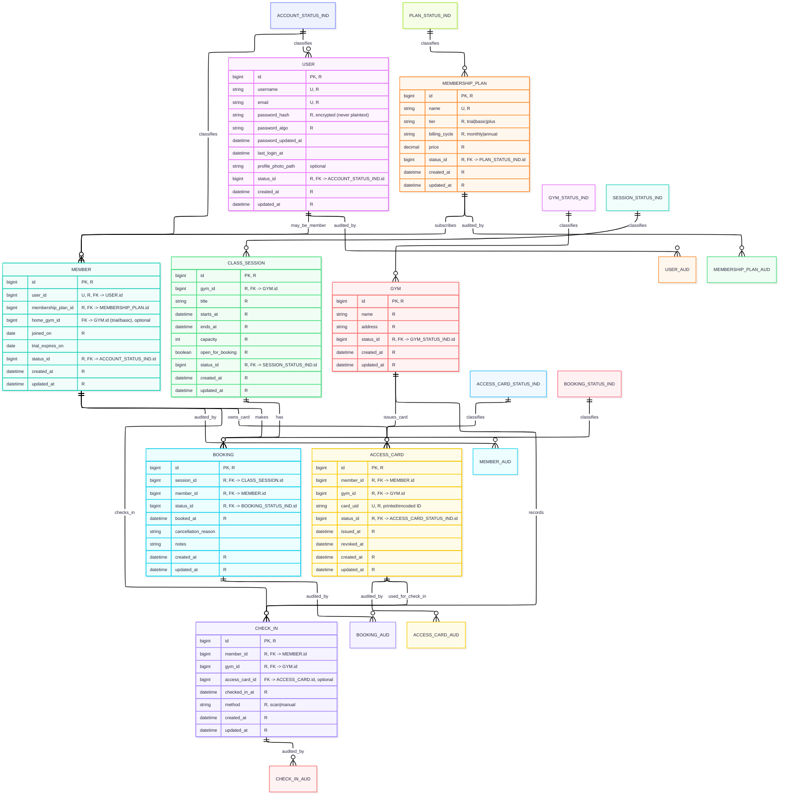
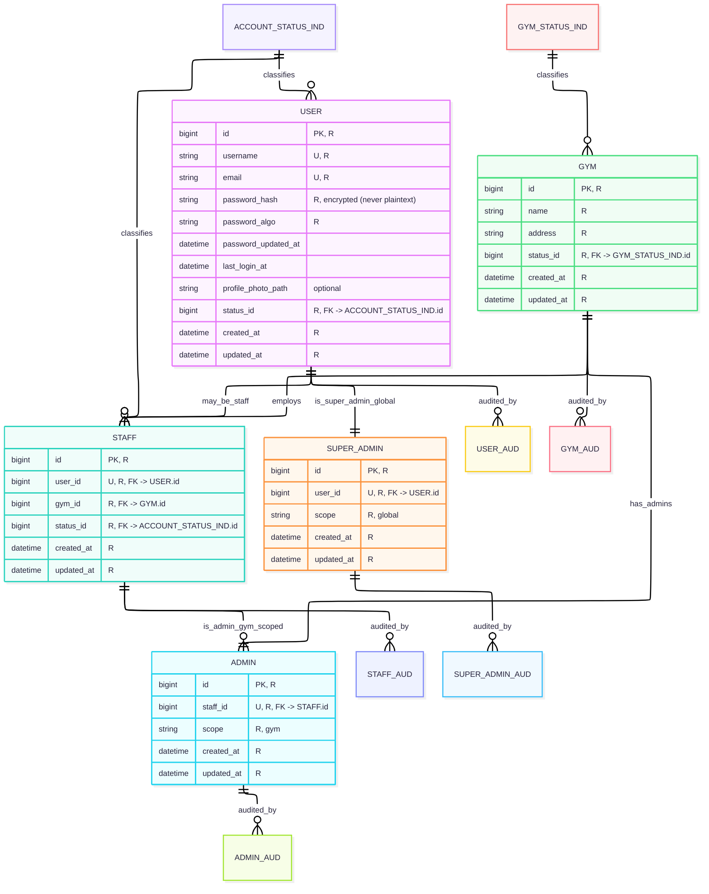
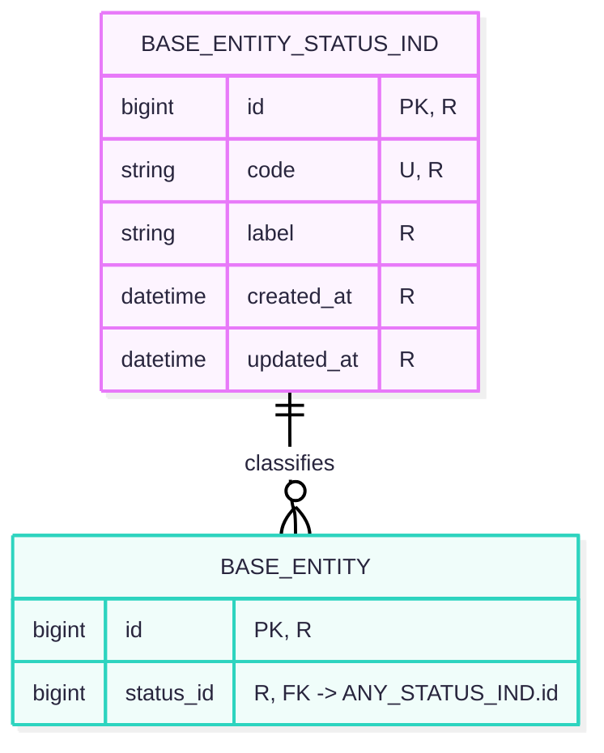
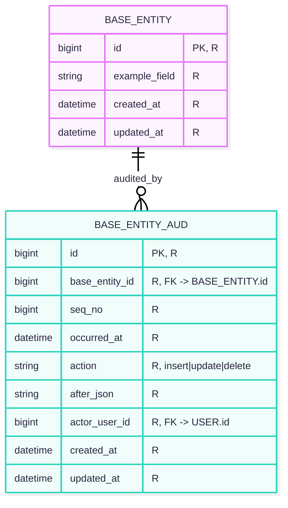

# Entity Relationship Diagrams (ERDs)

This document expands the high-level ERD from the TDD into digestible domain diagrams with attributes and notes.

**Diagrams included**
1. **Overview (no audit tables, no *_STATUS_IND)**
2. **Gym & Equipment (+ audits)**
3. **Staff (+ audits)**
4. **Classes & Trainer Availability (+ audits)**
5. **Members, Plans, Bookings & Check-ins (+ audits)**
6. **Admins (+ audits)**
7. **Status Indicator Table Structure**
8. **Audit Table Structure**

---

## 1) Overview (no audit or status indicator tables)
_Same as TDD overview, but **without** audit tables and **without** status indicator tables and **without attributes** for readability._

---

## 2) Gym & Equipment (+ audits)
_Equipment, items, inventory counts, service logs._

**Attribute types**
- **Key:** `GYM.id`, `EQUIP_KIND.id`, `EQUIPMENT_ITEM.id`, `INVENTORY_COUNT.id`, `SERVICE_LOG.id`
- **Composite:** none
- **Multi-valued:** none
- **Derived:** `next_clean_due_at` (from last_cleaned/intervals), `reorder_needed` (from quantities & threshold)

**Relevant triggers**
- `equipment_item_clean_due_update` - recalculate `next_clean_due_at` / `cleaning_required` when cleaned
- `service_log_item_flags` - on `SERVICE_LOG` insert: update `EQUIPMENT_ITEM.last_serviced_at`; set/reset `service_required` and `cleaning_required` based on `action`
- `inventory_reorder_flag` - on `INVENTORY_COUNT` change: recalculate `reorder_needed`
- `equip_item_status_guard` - for status to be `ok` whre must be no service/clean flags

**Relevant checks**
- **Column-level**:
  - `EQUIP_KIND.mode IN ('per_item','bulk')`
  - `EQUIPMENT_ITEM.uses_count >= 0`, `rated_uses > 0`, `cleaning_interval_uses >= 0`, `cleaning_interval_days >= 0`
  - `INVENTORY_COUNT.qty_on_floor >= 0`, `qty_in_storage >= 0`
- **Table-level**:
  - Unique `(gym_id, equip_kind_id)` in `INVENTORY_COUNT`
  - Partial unique on `(gym_id, serial_no)` where `serial_no IS NOT NULL` (or full unique if always present)
  - FKs `ON DELETE RESTRICT` for audits; `SERVICE_LOG.equipment_item_id` `ON DELETE RESTRICT`

**Indices**
- `GYM(name)`, `GYM(status_id)`, `GYM(created_at)`
- `EQUIP_KIND(name) UNIQUE`, `EQUIP_KIND(mode)`
- `EQUIPMENT_ITEM(gym_id, equip_kind_id)`, `EQUIPMENT_ITEM(status_id)`, `EQUIPMENT_ITEM(next_clean_due_at)`
- `INVENTORY_COUNT(gym_id, equip_kind_id) UNIQUE`, `INVENTORY_COUNT(updated_snapshot_at)`
- `SERVICE_LOG(equipment_item_id, serviced_at DESC)`, `SERVICE_LOG(staff_id)`

---

## 3) Staff (+ audits)
_Users, staff specializations, and floor managers monitoring equipment._

**Attribute types**
- **Key:** `USER.id`, `STAFF.id`, `TRAINER.id`, `MANAGER.id`, `FLOOR_MANAGER.id`, `FRONT_DESK.id`, `ADMIN.id`, `SUPER_ADMIN.id`
- **Composite:** none
- **Multi-valued:** none
- **Derived:** none

**Relevant triggers**
- `staff_gym_scope_guard` - ensure role’s `STAFF` belongs to the target `GYM`
- `user_status_login_guard` - prevent setting `USER.status='inactive'` if stil an active staff, etc.
- `user_password_hash_enforce` - validate hash format

**Relevant checks**
- **Column-level**:
  - `USER.status IN ('active','inactive','locked')`
  - `STAFF.status IN ('active','inactive')`
  - `ADMIN.scope = 'gym'`, `SUPER_ADMIN.scope = 'global'`
  - `FRONT_DESK.capabilities` subset check (enforced via permitted values or separate lookup table)
- **Table-level**:
  - Unique `(user_id)` in `STAFF`, unique `(staff_id)` in each specialization table
  - FK `STAFF.user_id -> USER.id` `ON DELETE RESTRICT`; specialization tables `ON DELETE CASCADE` from `STAFF`

**Indices**
- `USER(username) UNIQUE`, `USER(email) UNIQUE`, `USER(status_id)`, `USER(last_login_at)`
- `STAFF(user_id) UNIQUE`, `STAFF(gym_id, status_id)`, `STAFF(created_at)`
- Each role table: `(<role>.staff_id) UNIQUE`
- `EQUIPMENT_ITEM(status_id)`, `EQUIPMENT_ITEM(gym_id, equip_kind_id)`

---

## 4) Classes & Trainer Availability (+ audits)
_Sessions, trainer availability, staffing, and per-session equipment reservations._

**Attribute types**
- **Key:** `CLASS_SESSION.id`, `TRAINER_AVAIL_DATE.id`
- **Composite:** `SESSION_TRAINER(session_id, trainer_id)`, `SESSION_EQUIP_RESERVATION(session_id, equip_kind_id)`
- **Multi-valued:** none
- **Derived:** none

**Relevant triggers**
- `session_capacity_guard` - prevent inserts to `SESSION_TRAINER` beyond `CLASS_SESSION.max_trainers`
- `session_booking_open_guard` - prevent reservations/bookings when `open_for_booking = false`
- `availability_match_guard` - ensure trainer availability exists for session date/period & gym before `SESSION_TRAINER` insert
- `session_time_coherence` - ensure `ends_at > starts_at` and enforce allowed session windows (e.g., exclude 11:00–13:00 per policy)
- `session_equip_res_guard` - ensure `quantity >= 0` for the equipment to reserve and is ≤ available inventory in gym
- `session_cancel_cascade` - ensure that sessions that are canceled notify members and free up staff

**Relevant checks**
- **Column-level**:
  - `CLASS_SESSION.capacity > 0`, `max_trainers >= 1`
  - `CLASS_SESSION.status IN ('scheduled','canceled','completed')`
  - `TRAINER_AVAIL_DATE.period IN ('AM','PM')`, `status IN ('available','unavailable')`
  - `SESSION_EQUIP_RESERVATION.quantity >= 0`
- **Table-level**:
  - unique `(session_id, trainer_id)` in `SESSION_TRAINER`
  - unique `(session_id, equip_kind_id)` in `SESSION_EQUIP_RESERVATION`
  - `SESSION_TRAINER.session_id -> CLASS_SESSION.id` `ON DELETE CASCADE` (remove staffing if session is deleted)

**Indices**
- `CLASS_SESSION(gym_id, starts_at)`, `CLASS_SESSION(status_id, open_for_booking)`, `CLASS_SESSION(starts_at)`
- `TRAINER_AVAIL_DATE(trainer_id, for_date, period) UNIQUE`, `TRAINER_AVAIL_DATE(gym_id, for_date, period)`, `TRAINER_AVAIL_DATE(status_id)`
- `SESSION_TRAINER(session_id, trainer_id) UNIQUE`, `SESSION_TRAINER(trainer_id, session_id)`
- `SESSION_EQUIP_RESERVATION(session_id, equip_kind_id) UNIQUE`
---

## 5) Members, Plans, Bookings & Check-ins (+ audits)
_Memberships, bookings, access cards and check-ins (plus can check-in at any gym; trial/basic tied to home gym)._

**Attribute types**
- **Key:** `USER.id`, `MEMBERSHIP_PLAN.id`, `MEMBER.id`, `BOOKING.id`, `CHECK_IN.id`, `ACCESS_CARD.id`, `GYM.id`
- **Composite:** none
- **Multi-valued:** none
- **Derived:** none

**Relevant triggers**
- `booking_plus_only` - forbid `BOOKING` when member’s plan tier ≠ `plus`
- `booking_capacity_guard` - ensure confirmed bookings ≤ `CLASS_SESSION.capacity`
- `booking_unique_member_session` - prevent multiple active bookings for the same `(member_id, session_id)`
- `booking_window_guard` - restrict bookings to current and next month per policy
- `checkin_scope_guard` - allow `trial|basic` only at `home_gym_id`; `plus` at any gym
- `access_card_status_guard` - forbid check-ins with `ACCESS_CARD.status IN ('lost','revoked')`
- `user_password_hash_enforce` - validate hash format

**Relevant checks**
- **Column-level**:
  - `MEMBERSHIP_PLAN.tier IN ('trial','basic','plus')`, `billing_cycle IN ('monthly','annual')`, `price >= 0`
  - `MEMBER.status IN ('active','suspended','canceled')`
  - `BOOKING.status IN ('confirmed','canceled_member','canceled_system')`
  - `ACCESS_CARD.status IN ('active','lost','revoked')`
- **Table-level**:
  - unique `(username)` and `(email)` in `USER`
  - unique `(user_id)` in `MEMBER` (1:1 user↔member)
  - unique `(member_id, session_id)` in `BOOKING` (active rows)
  - unique `(card_uid)` in `ACCESS_CARD`

**Indices**
- `USER(username) UNIQUE`, `USER(email) UNIQUE`, `USER(status_id)`, `USER(last_login_at)`
- `MEMBERSHIP_PLAN(name) UNIQUE`, `MEMBERSHIP_PLAN(tier, status_id)`, `MEMBERSHIP_PLAN(price)`
- `MEMBER(user_id) UNIQUE`, `MEMBER(status_id)`, `MEMBER(membership_plan_id)`, `MEMBER(home_gym_id)`
- `BOOKING(session_id, member_id) UNIQUE`, `BOOKING(member_id, booked_at)`, `BOOKING(status_id)`
- `CHECK_IN(member_id, checked_in_at)`, `CHECK_IN(gym_id, checked_in_at)`
- `ACCESS_CARD(card_uid) UNIQUE`, `ACCESS_CARD(member_id, status_id)`, `ACCESS_CARD(gym_id, status_id)`

---

## 6) Admins (+ audits)
_Gym-scoped admins and global super-admins._

**Attribute types**
- **Key:** `USER.id`, `STAFF.id`, `ADMIN.id`, `SUPER_ADMIN.id`, `GYM.id`
- **Composite:** none
- **Multi-valued:** none
- **Derived:** none

**Relevant triggers**
- `admin_scope_guard` - enforce privilege scope is bound to one gym
- `user_admin_status_guard` - prevent orphaning of active users that have other roles
- maybe add one so some admin actions need approval from more admins

**Relevant checks**
- **Column-level**:
  - `USER.status IN ('active','inactive','locked')`
  - `ADMIN.scope = 'gym'`, `SUPER_ADMIN.scope = 'global'`
- **Table-level**:
  - Unique `(user_id)` in `STAFF`; unique `(staff_id)` in `ADMIN`

**Indices**
- `USER(username) UNIQUE`, `USER(email) UNIQUE`, `USER(status_id)`
- `STAFF(user_id) UNIQUE`, `STAFF(gym_id, status_id)`
- `ADMIN(staff_id) UNIQUE`
- `GYM(name)`, `GYM(status_id)`
---

## 7) Status Indicator Table Structure
_Generic structure for all `*_STATUS_IND` tables (serves as lookup tables)._

**Indicator families (examples)**
- `ACCOUNT_STATUS_IND` → `USER.status_id`, `STAFF.status_id`, `MEMBER.status_id`
  Codes: `ACTIVE, INACTIVE, LOCKED, SUSPENDED, CANCELED`
- `GYM_STATUS_IND` → `GYM.status_id` (e.g., `ACTIVE, INACTIVE`)
- `EQUIPMENT_STATUS_IND` → `EQUIPMENT_ITEM.status_id` (`OK, NEEDS_SERVICE, OUT_OF_ORDER, RETIRED`)
- `SESSION_STATUS_IND` → `CLASS_SESSION.status_id` (`SCHEDULED, CANCELED, COMPLETED`)
- `AVAILABILITY_STATUS_IND` → `TRAINER_AVAIL_DATE.status_id` (`AVAILABLE, UNAVAILABLE`)
- `PLAN_STATUS_IND` → `MEMBERSHIP_PLAN.status_id` (`ACTIVE, RETIRED`)
- `ACCESS_CARD_STATUS_IND` → `ACCESS_CARD.status_id` (`ACTIVE, LOST, REVOKED`)
- `BOOKING_STATUS_IND` → `BOOKING.status_id` (`CONFIRMED, CANCELED_MEMBER, CANCELED_SYSTEM`)

**Querying pattern examples**
- Active members:
  `... JOIN ACCOUNT_STATUS_IND si ON m.status_id = si.id AND si.code = 'ACTIVE'`
- Sessions open & scheduled:
  `... JOIN SESSION_STATUS_IND ssi ON cs.status_id = ssi.id AND ssi.code = 'SCHEDULED' AND cs.open_for_booking = TRUE`
- Equipment out or needs service:
  `... JOIN EQUIPMENT_STATUS_IND esi ON ei.status_id = esi.id AND esi.code IN ('NEEDS_SERVICE','OUT_OF_ORDER')`

---

## 8) Audit Table Structure
_Generic structure for all `*_AUD` tables._

**How states are captured (updated)**
- Triggers write `after_json` for each event. Prior state can be reconstructed from the **previous audit row’s `after_json`** (append-only history)
- `seq_no` provides a reliable ordering of the audits

**Constraints & integrity**
- `BASE_ENTITY_AUD(base_entity_id) → BASE_ENTITY(id)`
- `UNIQUE(seq_no)` (per-table sequence), plus index `(base_entity_id, seq_no)` for efficient timelines.

**Recommended indices (updated)**
- `(base_entity_id, seq_no)` **covering index** (primary read path)
- `(actor_user_id, seq_no)` for actor timelines
- `(occurred_at)` for time-range queries

**Rollback considerations**
- Rollbacks are constructed using the last **valid `after_json`** snapshot prior to the target time/sequence number (transactions are applied in reverse order to avoid inconsistencies)
