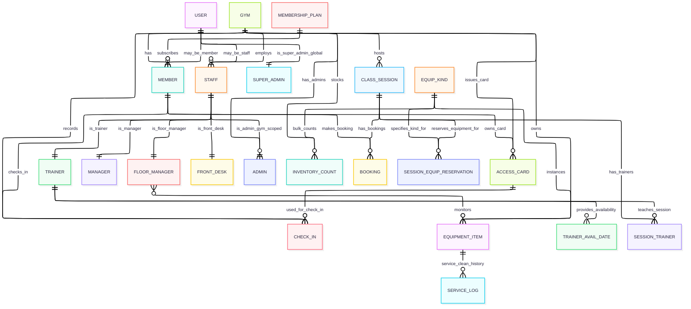
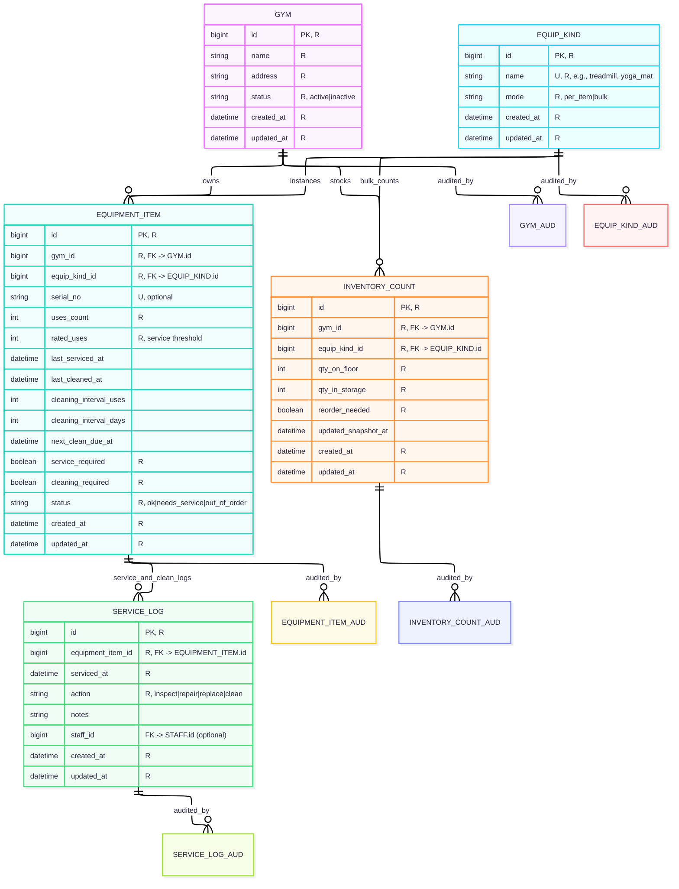
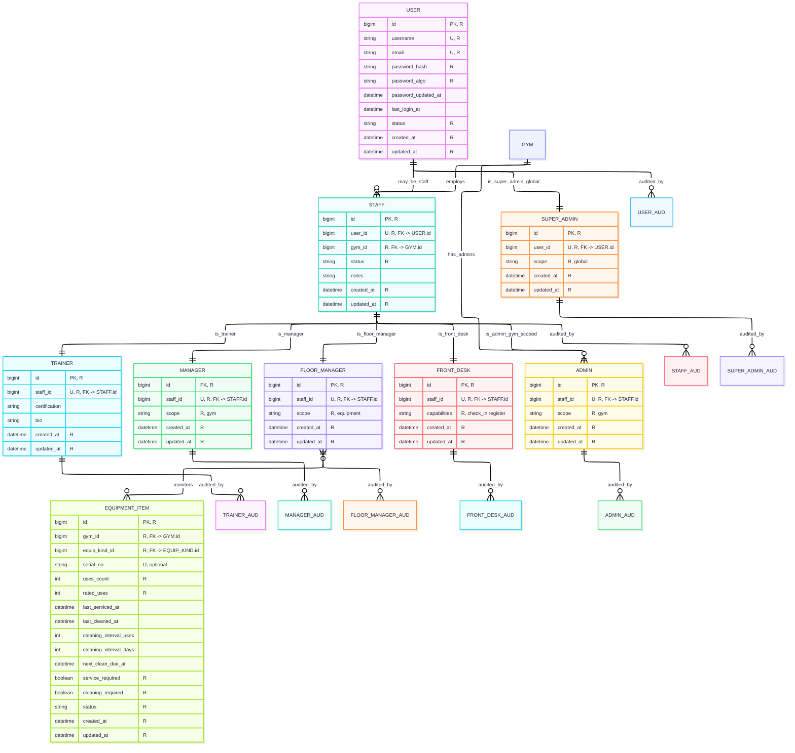
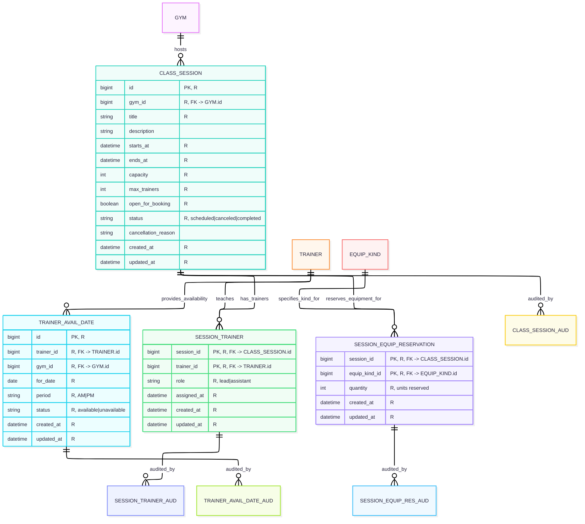
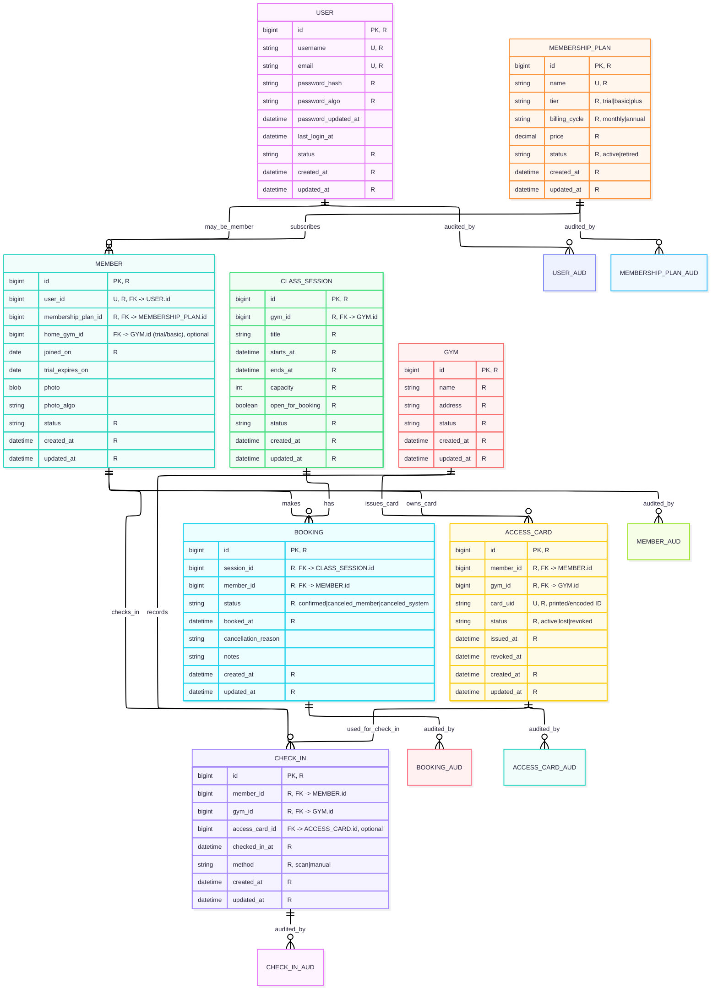
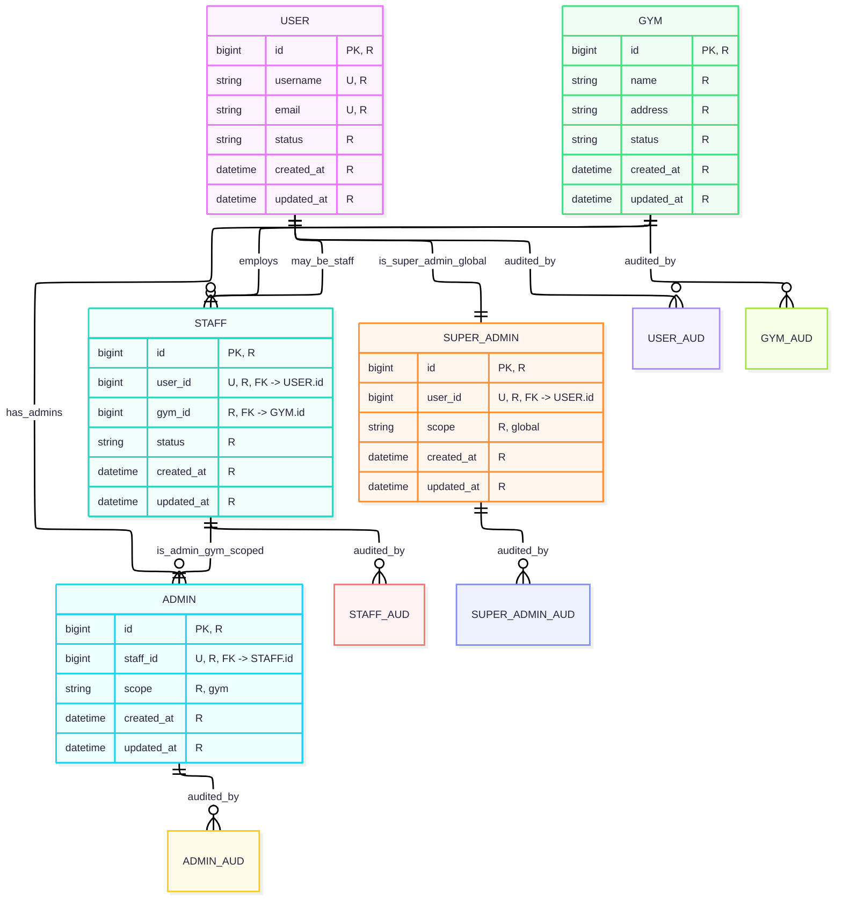
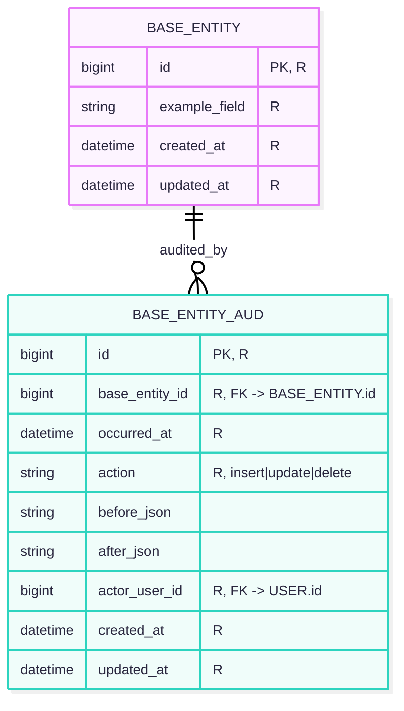

# Entity Relationship Diagrams (ERDs)

This document expands the high-level ERD from the TDD into digestible domain diagrams with attributes and notes.

**Diagrams included**
1. **Overview (no audit tables)**
2. **Gym & Equipment (+ audits)**
3. **Staff (+ audits)**
4. **Classes & Trainer Availability (+ audits)**
5. **Members, Plans, Bookings & Check-ins (+ audits)**
6. **Admins (+ audits)**
7. **Audit Table Structure**

---

## 1) Overview (no audit tables)
_Strictly the same entities and relationships as the TDD overview, but **without** audit tables and **without attributes** for readability._

---

## 2) Gym & Equipment (+ audits)
_Equipment, items, inventory counts, service logs._

**Attribute types**
- **Key:** `GYM.id`, `EQUIP_KIND.id`, `EQUIPMENT_ITEM.id`, `INVENTORY_COUNT.id`, `SERVICE_LOG.id`
- **Composite:** none
- **Multi-valued:** none
- **Derived:** `next_clean_due_at` (from last_cleaned/intervals), `reorder_needed` (from quantities & threshold)

**Relevant triggers (?)**

---

## 3) Staff (+ audits)
_Users, staff specializations, and floor managers monitoring equipment._

**Attribute types**
- **Key:** `USER.id`, `STAFF.id`, `TRAINER.id`, `MANAGER.id`, `FLOOR_MANAGER.id`, `FRONT_DESK.id`, `ADMIN.id`, `SUPER_ADMIN.id`
- **Composite:** none
- **Multi-valued:** none
- **Derived:** none

**Relevant triggers (?)**

---

## 4) Classes & Trainer Availability (+ audits)
_Sessions, trainer availability, staffing, and per-session equipment reservations._

**Attribute types**
- **Key:** `CLASS_SESSION.id`, `TRAINER_AVAIL_DATE.id`
- **Composite:** `SESSION_TRAINER(session_id, trainer_id)`, `SESSION_EQUIP_RESERVATION(session_id, equip_kind_id)`
- **Multi-valued:** none
- **Derived:** none

**Relevant triggers (?)**

---

## 5) Members, Plans, Bookings & Check-ins (+ audits)
_Memberships, bookings, access cards and check-ins (plus can check-in at any gym; trial/basic tied to home gym)._

**Attribute types**
- **Key:** `USER.id`, `MEMBERSHIP_PLAN.id`, `MEMBER.id`, `BOOKING.id`, `CHECK_IN.id`, `ACCESS_CARD.id`, `GYM.id`
- **Composite:** none
- **Multi-valued:** none
- **Derived:** none

**Relevant triggers (?)**

---

## 6) Admins (+ audits)
_Gym-scoped admins and global super-admins._

**Attribute types**
- **Key:** `USER.id`, `STAFF.id`, `ADMIN.id`, `SUPER_ADMIN.id`, `GYM.id`
- **Composite:** none
- **Multi-valued:** none
- **Derived:** none

**Relevant triggers (?)**

---

## 7) Audit Table Structure
_Generic reference structure for all `*_AUD` tables._

**How states are captured**
- Triggers on base tables (`BEFORE UPDATE/DELETE`, `AFTER INSERT/UPDATE`) populate `before_json`/`after_json` and record `actor_user_id`, `occurred_at` in the same transaction.