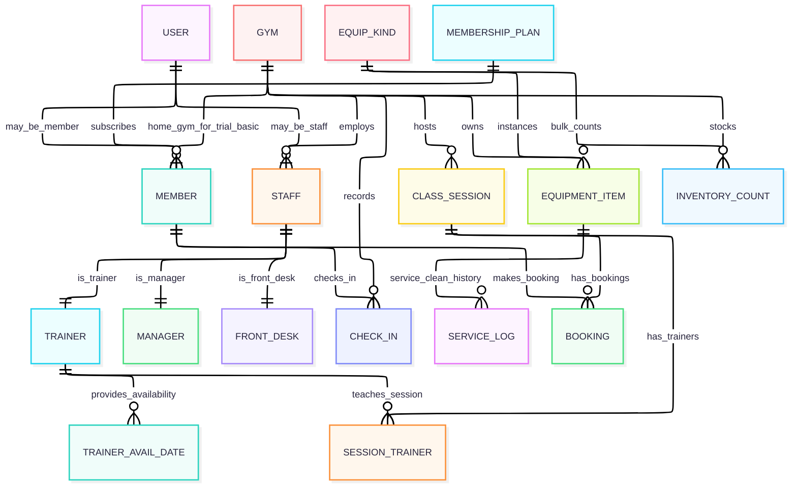
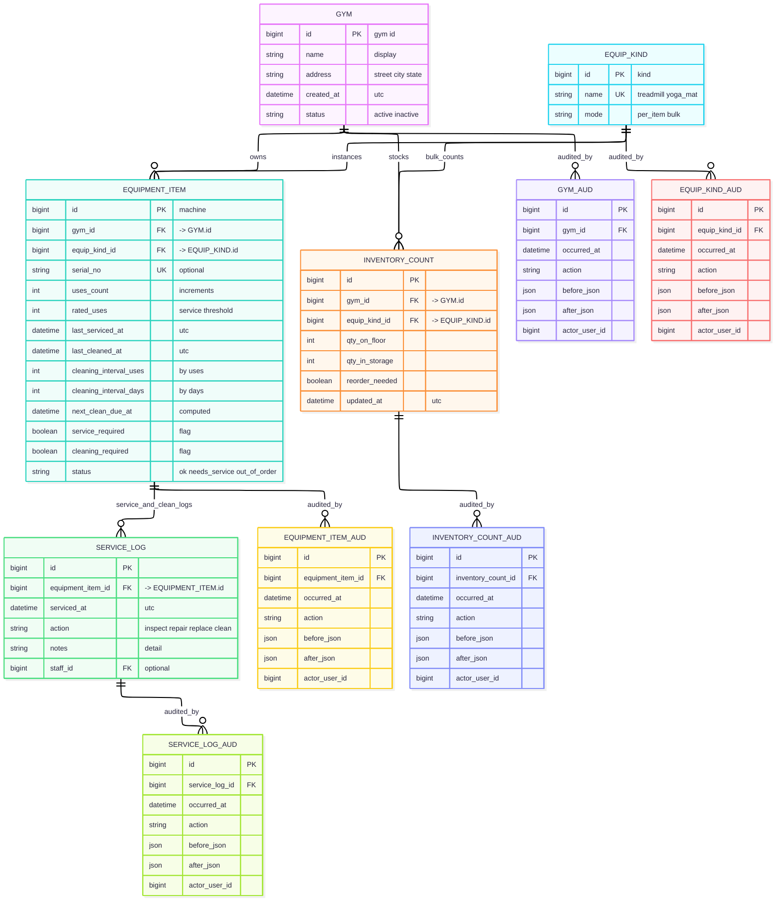
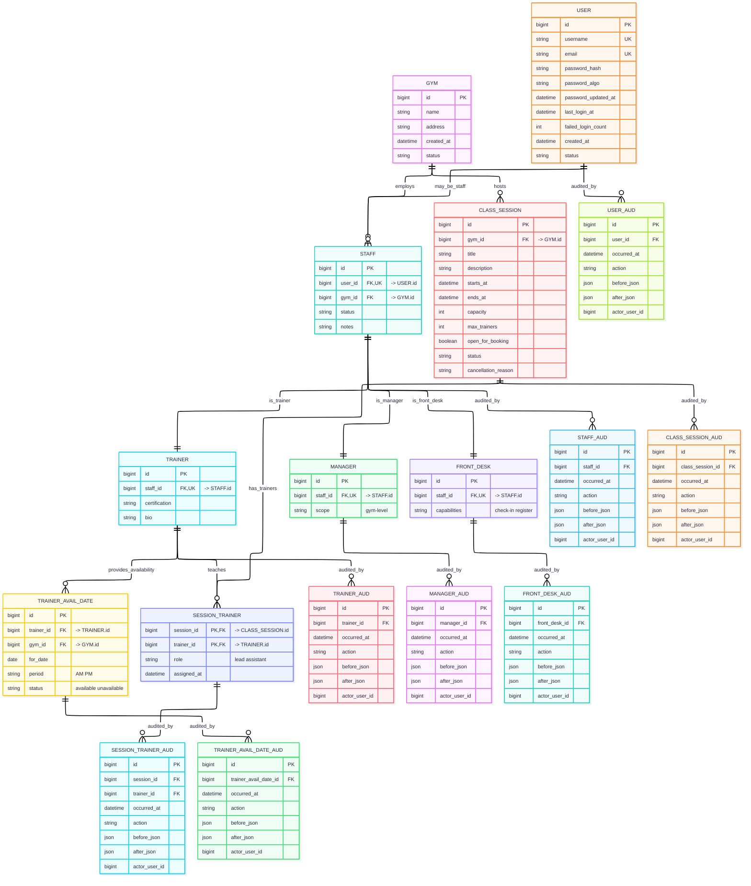
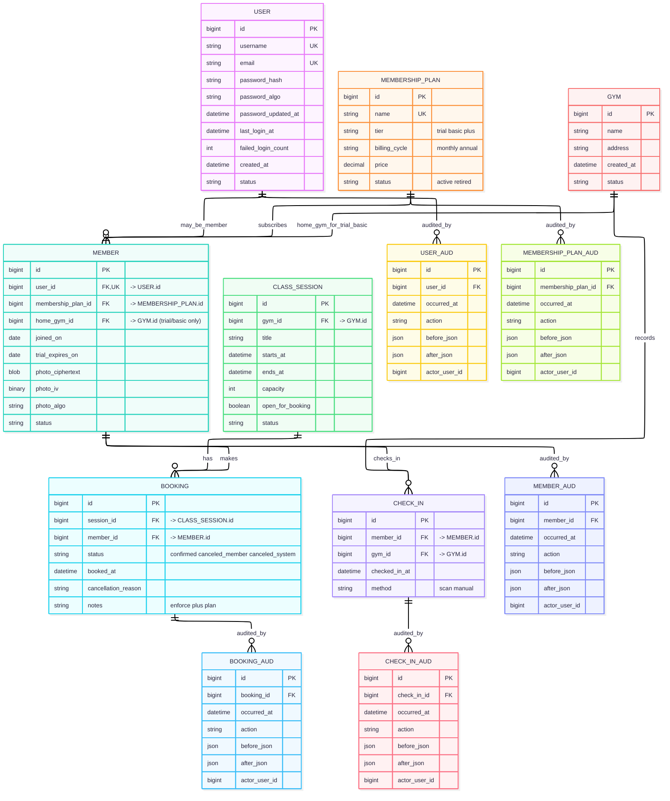

# Entity Relationship Diagrams

This file contains four Mermaid ERDs:
1. **Overview (no audit tables)**
2. **Gym & Equipment (+ audits)**
3. **Staff, Classes & Trainer Availability (+ audits)**
4. **Members, Plans, Bookings & Check-ins (+ audits)**

---

## 1) Overview — no audit tables

---

## 2) Gym & Equipment (+ audits)

---

## 3) Staff, Classes & Trainer Availability (+ audits)

---

## 4) Members, Plans, Bookings & Check-ins (+ audits)

