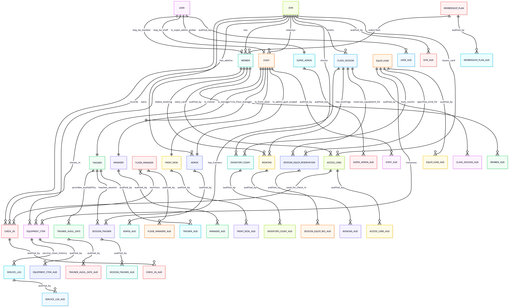
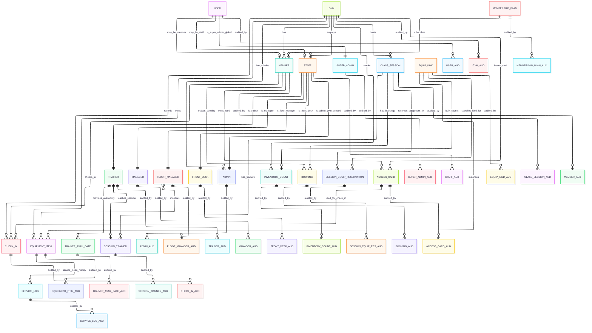

# Technical Design Document

## 1. Document Control
- **Version:**  2.1
- **Author:**  Henry Huerta
- **Date:**  2025-11-3
- **Reviewers:**  Prof. Arnold Lau, T.A. Sneh Bhandari

## 2. Introduction
This TDD specifies the technical implementation details for the Gym Membership Management System ("FitDB"). The design emphasizes the database layer: RBAC (SQL roles), auditable transactions, and denormalized reporting views.

(See [`README.md`](../README.md) for MVP and roadmap, and [`MVP_SCOPE.md`](./MVP_SCOPE.md) for detailed MVP clarification.)

### 2.1 MVP Scope
**Current Phase (MVP):**
The MVP focuses exclusively on core account and access card management:
- User account creation (username, email, password)
- Member account registration by front desk managers
- Access card issuance by front desk managers
- Audit logging for all operations
- RBAC infrastructure (front desk manager role enabled)

**Future Phases:**
While the database schema supports the full feature set, the following will be implemented post-MVP:
- Session management and bookings
- Check-in system
- Equipment management
- Reporting and analytics
- Advanced member management

The database schema is designed to support all future features without requiring schema changes.

## 3. High-Level Architecture
- **Application Layer:** Flask (Python) web framework
- **Database Layer:** MySQL (system of record)
- **Services:** Auth/RBAC, Membership, Audit
- **Storage:** Static assets and member photos stored locally in development
- **Future:** AWS S3 for production photo storage, optional load balancing

### 3.1 Three-Tier Architecture
| Layer                | Description / Responsibilities                                                                                                          |
|----------------------|-----------------------------------------------------------------------------------------------------------------------------------------|
| **Presentation**     | Flask Templates, HTML/CSS                                                                                                               |
|                      | *User Interface*                                                                                                                        |
| **Business Logic**   | Flask App (Python):                                                                                                                     |
|                      | &mdash; Authentication & Authorization<br> &mdash; Business Rules Enforcement<br> &mdash; Transaction Management<br> &mdash; Audit Logging |
| **Data Layer**       | MySQL+:                                                                                                                             |
|                      | &mdash; Tables, Views, Procedures<br> &mdash; Triggers, Indexes<br> &mdash; RBAC via SQL Roles<br> &mdash; Audit Tables                   |

## 4. Detailed Design

### 4.1 Data Model
**ER Diagram**
_Overview with audit tables. For separated diagrams (overview **without** audits, plus three clearer ERDs), see **[ERDs.md](./ERDs.md)**._

#### 4.1.0 Database Design Decisions

**Normalization Level:**
- **Chosen:** Third Normal Form (3NF)
- **Rationale:** 
  - Eliminates redundancy without sacrificing query performance
  - Maintains data integrity through proper foreign key relationships
  - Allows for efficient updates and joins
  - Balance between normalization and practical considerations

**Strategic Denormalization:**
- **Audit Tables:** Use `after_json` field to store complete snapshots (allows for quick state reconstruction without joins)
- **Reporting Views:** Denormalized views aggregate data for fast queries (utilization, equipment demand)
- **Rationale:** Performance optimization for read-heavy operations while maintaining single source of truth in base tables

**Indexing Strategy:**
- **Primary Keys:** All tables have auto-incrementing BIGINT primary keys
- **Foreign Keys:** Automatically indexed in MySQL
- **Unique Constraints:** Username, email, card_uid, composite keys for business rules
- **Composite Indexes:** Created on frequently queried combinations (e.g., `(gym_id, starts_at)`, `(member_id, session_id)`)
- **Covering Indexes:** Audit tables indexed for common query patterns

**Data Type Choices:**
- **BIGINT for IDs:** Supports scaling to millions of records
- **VARCHAR for text:** Appropriate lengths to prevent waste and overflow
- **DATETIME for timestamps:** Precise to second granularity (sufficient for business needs)
- **DATE for dates:** Used where time-of-day is irrelevant (membership dates, availability)
- **ENUM considered but rejected:** Status values stored via foreign keys to indicator tables (more flexible, easier to add/modify values)

**Referential Integrity:**
- **Foreign Keys:** Enforced on all relationships
- **ON DELETE Behavior:** 
  - `CASCADE` for audit tables (deleting a record should remove its audit trail)
  - `RESTRICT` for core relationships (prevent deletion that would orphan records)
- **ON UPDATE:** Default `CASCADE` for ID propagation

**Constraint Enforcement:**
- **Check Constraints:** Column-level validation (status codes, date ranges, quantities ≥ 0)
- **Triggers:** Business rule enforcement that cannot be expressed via simple constraints
- **Application Layer:** Additional validation for complex business logic




<!--

-->

#### 4.1.1 Cardinality
- **1:1**
  - `USER` ↔ `MEMBER` (optional specialization per user)
  - `USER` ↔ `STAFF` (optional specialization per user)
  - `STAFF` ↔ `ADMIN` / `TRAINER` / `MANAGER` / `FLOOR_MANAGER` / `FRONT_DESK` (each role maps to exactly one `STAFF`)
- **1:N**
  - `GYM` → `STAFF`, `ADMIN`, `CLASS_SESSION`, `CHECK_IN`, `EQUIPMENT_ITEM`, `INVENTORY_COUNT`, `MEMBER`
  - `EQUIP_KIND` → `EQUIPMENT_ITEM`, `INVENTORY_COUNT`
  - `TRAINER` → `TRAINER_AVAIL_DATE`
  - `CLASS_SESSION` → `BOOKING`
  - `MEMBER` → `BOOKING`, `CHECK_IN`, `ACCESS_CARD`
  - `GYM` → `ACCESS_CARD`
- **M:N**
  - `CLASS_SESSION` ↔ `TRAINER` (through `SESSION_TRAINER`)
  - `FLOOR_MANAGER` ↔ `EQUIPMENT_ITEM` (monitoring)
  - `CLASS_SESSION` ↔ `EQUIP_KIND` (through **weak** `SESSION_EQUIP_RESERVATION`)
  - `MEMBER` ↔ `GYM` (through `CHECK_IN`)

#### 4.1.2 Participation Constraints
- **Total participation (mandatory)**
  - every `TRAINER`, `MANAGER`, `FLOOR_MANAGER`, `FRONT_DESK`, `ADMIN` **must** be a `STAFF`.
  - every `CLASS_SESSION` **belongs to** a `GYM`.
  - every `BOOKING` **references** one `CLASS_SESSION` and one `MEMBER`.
  - `SESSION_TRAINER`, `SESSION_EQUIP_RESERVATION`, `INVENTORY_COUNT`, `CHECK_IN`, and `ACCESS_CARD` **cannot exist** without their parents
- **Partial participation (optional)**
  - a `USER` **may** be a `MEMBER` and/or `STAFF` (not required to be either).
  - a `GYM` **may** have zero `CLASS_SESSION`s or `EQUIPMENT_ITEM`s at initialization.
  - a `MEMBER` **may** have zero `BOOKING`s or `CHECK_IN`s.

> **Note:**
> indexes, attribute typing (key/derived/multi-valued/composite), and the detailed audit schema will be documented in **ERDs.md**.

### 4.2 API Design (Post-MVP)
- **Auth:** `POST /api/auth/register` (user account creation), `POST /api/auth/login`, `GET /api/me`
- **Front Desk:** `POST /api/front-desk/members` (create member account), `POST /api/front-desk/access-cards` (issue access card)
- **Sessions & Booking:** `GET /api/sessions`, `POST /api/bookings`, `DELETE /api/bookings/{id}`
- **Trainer:** `GET/POST /api/trainer/availability` (AM/PM per date)
- **Manager:** `POST /api/manager/sessions` (create/cancel/assign trainer)
- **Equipment:** `GET /api/equipment/items`, `POST /api/equipment/service-logs`
- **Reports:** `GET /api/reports/class-utilization`, `GET /api/reports/equipment-demand`

### 4.3 Entitlements Summary

- r_member: Can view personal profile/bookings/check-ins/available sessions; check in.
- r_plus_member: All r_member rights plus booking sessions, cancel own bookings, view bookable sessions.
- r_trainer: Can view personal profile (trainer version), trainer schedule, class rosters; set availability.
- r_front_desk: Can view member lookup; issue/revoke access cards; check in.
- r_floor_manager: Can view equipment status; log equipment service; snapshot inventory.
- r_manager: Can view everything above plus utilization/equipment demand reports; manage sessions, trainers, access cards, register/ban members, cancel bookings.
- r_admin_gym: All r_manager functions plus view audit logs; create user accounts.
- r_super_admin: All functions, including gym/role management.

*Special notes:* 
- Trainers see their own info in a trainer-specific format.
- Members can check in only when membership is valid.

### 4.4 Application Logic
**Booking Workflow (transactional)**
1. verify role = `plus_member`; session is `scheduled` and within bookable window
2. capacity check + equipment sufficiency (per-attendee requirements × seats)
3. insert `Booking`; write audit; commit or rollback on any failure

**Publish Sessions (manager)**
1. expand `TrainerAvailability` into sessions for date range
2. validate conflicts and equipment availability; create `ClassSession` rows; write audit transactionally

**Check-In**
- validate active membership; insert `CheckIn`; write audit

#### Stored Procedures
- **`sp_book_session(p_member_id, p_session_id)`**: validates plus membership, capacity, status; inserts `BOOKING`; writes `BOOKING_AUD`.
- **`sp_cancel_booking(p_member_id, p_booking_id, p_reason)`**: ensures staff/admin; updates status; writes `BOOKING_AUD`.
- **`sp_check_in(p_member_id, p_gym_id, p_card_uid)`**: validates membership/card; inserts `CHECK_IN`; writes `CHECK_IN_AUD`.
- **`sp_set_availability(p_trainer_id, p_gym_id, p_for_date, p_period)`** / **`sp_remove_availability(...)`**: upsert/delete `TRAINER_AVAIL_DATE`; write `TRAINER_AVAIL_DATE_AUD`.
- **`sp_publish_sessions(p_gym_id, p_start_date, p_end_date)`**: creates `CLASS_SESSION` batches from availability; writes `CLASS_SESSION_AUD`.
- **`sp_assign_trainer(p_session_id, p_trainer_id, p_role)`** / **`sp_unassign_trainer(...)`**: maintains `SESSION_TRAINER`; writes `SESSION_TRAINER_AUD`.
- **`sp_reserve_session_equipment(p_session_id, p_equip_kind_id, p_qty)`**: upsert `SESSION_EQUIP_RESERVATION`; validates stock; writes `SESSION_EQUIP_RES_AUD`.
- **`sp_log_equipment_service(p_item_id, p_action, p_staff_id, p_notes)`**: inserts `SERVICE_LOG`; updates flags; writes `SERVICE_LOG_AUD`.
- **`sp_snapshot_inventory(p_gym_id)`**: recomputes `INVENTORY_COUNT` for dashboards; writes `INVENTORY_COUNT_AUD`.
- **`sp_member_register(p_user_id, p_plan_id, p_home_gym_id)`**: creates `MEMBER`; assigns role; writes `MEMBER_AUD`.
- **`sp_access_card_issue(p_member_id, p_gym_id, p_card_uid)`** / **`sp_access_card_revoke(...)`**: maintains `ACCESS_CARD`; writes `ACCESS_CARD_AUD`.

> **Audit note:** procedures call a shared helper to append a `*_AUD` row with `(seq_no, occurred_at, action, after_json, actor_user_id)`

#### RBAC Mapping

- **`r_member`**
  - **EXECUTE:** `sp_check_in`, read-only helper procs
  - **SELECT:** views `vw_sessions_open`, `vw_member_profile`, `vw_member_checkins`, `vw_member_bookings`
- **`r_plus_member`** (inherits `r_member`)
  - **EXECUTE:** `sp_book_session`, `sp_cancel_booking`
  - **SELECT:** `vw_bookable_sessions`
- **`r_trainer`**
  - **EXECUTE:** `sp_set_availability`, `sp_remove_availability`
  - **SELECT:** `vw_trainer_schedule`, `vw_trainer_class_rosters`
- **`r_manager`**
  - **EXECUTE:** `sp_publish_sessions`, `sp_assign_trainer`, `sp_unassign_trainer`
  - **SELECT:** `vw_equipment_demand`, `vw_class_utilization`, `vw_all_rosters`
- **`r_front_desk`**
  - **EXECUTE:** `sp_check_in`, `sp_access_card_issue`, `sp_access_card_revoke`
  - **SELECT:** `vw_member_lookup_minimal`, `vw_cards_by_gym`
- **`r_floor_manager`**
  - **EXECUTE:** `sp_log_equipment_service`, `sp_snapshot_inventory`
  - **SELECT:** `vw_equipment_status`, `vw_cleaning_due`, `vw_service_due`
- **`r_admin_gym`**
  - **EXECUTE:** all above + maintenance procs
  - **SELECT/INSERT/UPDATE/DELETE:** on gym-scoped tables where needed
- **`r_super_admin`**
  - **ALL PRIVILEGES** incl. `CREATE ROLE`, `GRANT`

### 4.5 User Interface

#### 4.5.1 Interface Types

**Web-Based Portal (Flask Application)**
- **Primary Interface:** Browser-based web application
- **Technology:** Flask templates for server-side rendering
- **Responsive Design:** Mobile-friendly CSS
- **No JavaScript Framework:** Vanilla JavaScript for MVP simplicity

**Database CLI Access**
- **Direct Access:** MySQL command-line for admins
- **Read-Only:** Most users interact via application layer
- **Procedures:** Business operations via stored procedures

#### 4.5.2 MVP Interfaces (Post-MVP)

**User Account Creation Page**
```
Registration Form:
├── Username input
├── Email input
├── Password input
└── Submit → Creates USER account
```

**Front Desk Manager Console**
```
Dashboard:
├── Member Registration
│   ├── User lookup (by username/ID)
│   ├── Membership plan selection
│   ├── Home gym selection
│   └── Create member account
└── Access Card Management
    ├── Member lookup
    ├── Card UID input
    ├── Gym selection
    └── Issue access card
```

#### 4.5.3 Future Interfaces (Post-MVP)

**Member Portal (trial/basic/plus)**
```
Dashboard:
├── Profile View
│   ├── Personal information
│   ├── Membership plan details
│   ├── Check-in history
│   └── Access card status
├── Class Sessions
│   ├── Available sessions list
│   └── Upcoming sessions (plus only)
├── Bookings (plus only)
│   ├── Current bookings
│   └── Booking cancellation
└── Check-In
    └── Manual check-in option
```

**Trainer Portal**
```
Dashboard:
├── Availability Management
│   ├── View availability calendar
│   ├── Set availability (date/period)
│   └── Remove availability
└── Class Rosters
    ├── Assigned sessions
    └── Member attendance lists
```

**Manager Console**
```
Dashboard:
├── Session Management
│   ├── View trainer availability
│   ├── Publish sessions
│   ├── Assign trainers
│   └── Cancel sessions
├── Member Management
│   ├── Member lookup
│   ├── Register new members
│   ├── Issue strikes/bans
│   └── Revoke access cards
└── Reporting
    ├── Class utilization
    ├── Equipment demand
    └── Member analytics
```

**Front Desk Console**
```
Dashboard:
├── Member Lookup
│   └── Search by username/email
├── Check-In Management
│   ├── Manual check-in
│   └── Card-based check-in
└── Access Card Management
    ├── Issue new cards
    └── Revoke lost cards
```

**Floor Manager Console**
```
Dashboard:
├── Equipment Status
│   ├── By equipment type
│   ├── By status (OK/Needs Service/Out of Order)
│   └── Cleaning due alerts
├── Service Management
│   ├── Log service actions
│   └── Update equipment status
└── Inventory Snapshots
    └── Manual inventory counts
```

**Admin Console (Gym-Scoped)**
```
Dashboard:
├── Full Manager Access
├── User Management
│   ├── Create users
│   ├── Assign roles
│   └── Deactivate accounts
├── Audit Viewer
│   └── View all audit logs
└── System Configuration
    └── Gym-specific settings
```

**Super Admin Console (Global)**
```
Dashboard:
├── All Admin Functions
├── Multi-Gym Management
│   ├── Create/edit gyms
│   └── Gym status management
├── Global User Management
├── Role Management
│   ├── Grant/revoke roles
│   └── Role hierarchies
└── System-Wide Reports
```

#### 4.5.4 Interface Design Principles
- **Role-Based Dashboards:** Customized views per user role
- **Progressive Disclosure:** Show only relevant information
- **Responsive Tables:** Pagination for large datasets
- **Real-Time Updates:** Session capacity updates, booking confirmations
- **Error Handling:** Clear error messages with actionable guidance
- **Accessibility:** Semantic HTML, ARIA labels (MVP basic support)

### 4.6 SQL Views
- **`vw_sessions_open`**: sessions `SCHEDULED` & `open_for_booking`
- **`vw_bookable_sessions`**: `vw_sessions_open` + capacity remaining; hides full sessions
- **`vw_trainer_schedule`**: availability vs. assigned sessions for a trainer
- **`vw_trainer_class_rosters`**: roster with member display name
- **`vw_class_utilization`**: per-session capacity, seats taken, % utilization
- **`vw_equipment_status`**: item status, service/clean flags; by gym
- **`vw_cleaning_due` / `vw_service_due`**: items due by date, etc.
- **`vw_equipment_demand`**:`SESSION_EQUIP_RESERVATION` and frequency of use
- **`vw_member_profile`**: safe member profile (joins `USER`), photo path inherited from `USER`.
- **`vw_member_bookings` / `vw_member_checkins`**: member-scoped history
- **`vw_member_lookup_minimal`**: front-desk-friendly lookup (username, plan, photo path)
- **`vw_cards_by_gym`**: active cards issued by gym

_View Note_
- WHERE clauses enforce active statuse

## 5. Technology Stack

### 5.1 Core Technologies
- **Programming Language:** Python
- **Web Framework:** Flask
- **Database:** MySQL
  - Features used: Roles, Stored Procedures, Triggers, JSON support
  - Character set: UTF8MB4 with unicode collation
- **Frontend:** HTML, CSS (vanilla, no JS framework for MVP)
- **Testing:** manual SQL testing
- **Dependencies Management:** pip, requirements.txt

### 5.2 Python Dependencies
- `Flask` - Web framework
- `mysql-connector-python` - Database connectivity
- `faker` - Test data generation
- `python-dotenv` - Environment variable management (optional)

### 5.3 Development Tools
- **Make** - Build automation (Makefile)
- **MySQL CLI** - Database management
- **Git** - Version control
- **VS Code** - Development environment

## 6. Security & Compliance

### 6.1 Authentication
- **Password Storage:** Passwords are hashed using secure algorithms (stored in `USER.password_hash`)
- **Password Policy:** Never stored in plaintext; algorithm tracked in `USER.password_algo`
- **Password Updates:** Timestamp tracked in `USER.password_updated_at`
- **Last Login:** Tracked for security monitoring in `USER.last_login_at`

### 6.2 Authorization (RBAC)
**Role Hierarchy and Inheritance:**
```
r_super_admin (global admin, ALL PRIVILEGES)
    └── r_admin_gym (gym-scoped admin, full gym access)
          ├── r_manager (session publishing, equipment, reporting)
          │     ├── r_front_desk (check-ins, card management)
          │     └── r_floor_manager (equipment maintenance)
          └── r_trainer (availability, roster views)
r_member (basic access, profile viewing)
    └── r_plus_member (inherits r_member, adds booking permissions)
```

**Grant Strategy:**
- Least privilege: roles only have access to necessary tables/views/procedures
- Inheritance: `r_plus_member` inherits from `r_member` via MySQL role inheritance
- Separation of concerns: Each role has distinct permissions
- Super admin: Can grant/revoke roles and has ALL PRIVILEGES

### 6.3 SQL Injection Prevention
- **Parameterized Queries:** All SQL queries use parameter binding
- **Stored Procedures:** Business logic encapsulated in procedures with parameters
- **Input Validation:** Application layer validates all user inputs
- **Dynamic SQL:** Minimized; when used, inputs are sanitized

### 6.4 Data Protection
- **PII Handling:** User passwords, emails, photos protected
- **Profile Photos:** Stored as file paths (not BLOBs) for performance; default image when NULL
- **Encryption:** Passwords hashed; photos optionally encrypted in production

### 6.5 Audit & Compliance
- **Immutable Audit Trail:** All `*_AUD` tables are append-only (no UPDATE/DELETE allowed)
- **Audit Fields:** Every audit record contains:
  - `seq_no` - Sequential ordering
  - `occurred_at` - Precise timestamp
  - `action` - Operation type (insert/update/delete)
  - `after_json` - Complete state snapshot (JSON)
  - `actor_user_id` - Who performed the action
- **Audit Triggers:** Database triggers automatically write audit records
- **Compliance:** Audit trail enables regulatory compliance and forensic analysis

### 6.6 Network Security
- **Connection Encryption:** TLS for production (optionally enabled via MySQL SSL)
- **Access Control:** MySQL users restricted by host (@'%' for flexibility, can be @'localhost' for security)
- **Default Passwords:** Changed from defaults in production

### 6.7 Data Integrity
- **Referential Integrity:** Foreign keys enforce relationships
- **Check Constraints:** Column-level validation (status codes, date ranges)
- **Trigger-Based Validation:** Business rules enforced via triggers
- **Transaction Isolation:** ACID properties maintained via MySQL transactions

## 7. Performance Considerations

### 7.1 Database Performance
- **Indexing Strategy:** 
  - Foreign keys automatically indexed in MySQL
  - Unique constraints indexed (`(member_id, session_id)`, `(card_uid)`)
  - Composite indexes for common queries (e.g., `(gym_id, starts_at)`)
  - Covering indexes for audit tables `(base_entity_id, seq_no)`
- **Query Optimization:**
  - Stored procedures reduce network round-trips
  - Views denormalize data for reporting queries
  - EXPLAIN/ANALYZE used to optimize query plans
- **Partitioning:** Not needed for MVP but can partition audit tables by date in production
- **Connection Pooling:** Flask application uses connection pooling for efficiency

### 7.2 Application Performance
- **Pagination:** Large result sets (bookings, check-ins, audit logs) are paginated
- **Caching Strategy:** 
  - Static assets (CSS, images) cached
  - Session data cached in Flask session
  - Views cached at database level
- **Target Response Times:**
  - Simple queries (< 500ms)
  - Complex reports (< 3s)
  - Booking transactions (< 1s)

### 7.3 Performance Testing
- Test with datasets: tiny (10 members), small (100), medium (1,000), large (10,000), huge (100,000)
- Measure: booking transaction time, session listing, utilization reports
- Document EXPLAIN/ANALYZE outputs for critical queries

## 8. Scalability Considerations

### 8.1 Current Scale (MVP)
- **Gym Count:** 1 (expandable to many)
- **Concurrent Users:** < 100
- **Data Volume:** 10,000-100,000 members feasible with proper indexing

### 8.3 Vertical Scaling
- **MySQL Configuration:** Buffer pool sizing, query cache (if applicable)
- **Server Resources:** CPU, RAM, SSD storage
- **Connection Limits:** Configure max_connections appropriately

### 8.4 Multi-Tenancy Support
- **Schema Design:** Already supports multiple gyms via `gym_id`
- **Data Isolation:** Gym-scoped admins ensure isolation
- **Future:** Could implement separate databases per gym if needed

### 8.5 Future Growth Considerations
- **Archival Strategy:** Archive old audit logs (> 2 years) to cold storage
- **Lazy Evaluation:** Defer heavy calculations until needed
- **Async Processing:** Background jobs for reporting generation
- **CDN:** Serve static assets via CDN in production

## 9. Risks & Mitigations
- **Overbooking or equipment conflicts** → DB constraints + transaction checks
- **RBAC misconfiguration** → explicit role grants
- **ERD conflicts** → ERD reviews
- **Scope considerations** → enforce MVP

## 10. Testing Strategy
- **Unit tests:** booking constraints, session publish logic, RBAC decorators
- **Integration tests:** transaction rollbacks on forced failures; seed users/roles
- **SQL tests:** views return expected utilization/equipment demand

## 11. Deployment & Monitoring
- **Runtime logging:** audit stored in DB as JSON snapshots
- **Metrics:** latency, error rates, booking success/failure counts
- **Backups:** DB snapshots/backups

## 12. GitHub Repository

**Repository:** [https://github.com/hah97/FitDB](https://github.com/hah97/FitDB)

### Repository Structure
- **`/sql/`** - Database schema files
- **`/data/`** - Seed data generation
- **`/scripts/`** - Automation and utilities
- **`/docs/`** - Comprehensive documentation
- **`Makefile`** - Build automation with targets
- **`README.md`** - Project overview, setup instructions, and current status
- **`requirements.txt`** - Python dependencies

### Setup Instructions
See [README.md](https://github.com/hah97/FitDB/blob/main/README.md) for detailed setup instructions 