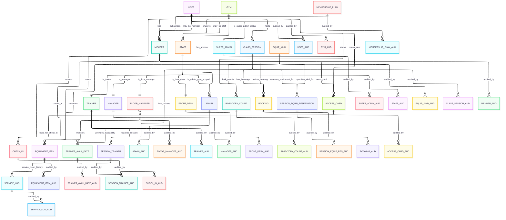

# Technical Design Document

## 1. Document Control
- **Version:** 1.3
- **Authors:** Henry Huerta, Jared Cordova
- **Date:** 2025-09-29
- **Reviewers:** Prof. Arnold Lau, T.A. Sneh Bhandari

## 2. Introduction
This TDD specifies the technical implementation details for the Gym Membership Management System (“FitDB”). The design emphasizes the database layer: RBAC (SQL roles), auditable transactions, and denormalized reporting views.

(See [`README.md`](./docs/README.md) for MVP and roadmap.)

## 3. High-Level Architecture
- Services: Auth/RBAC, Membership, Scheduling, Equipment, Reporting, Audit
- Backend: Flask (Python)
- Database: MySQL (system of record)
- Dev: static assets and member photos stored locally in dev

(create visual diagram)

## 4. Detailed Design

### 4.1 Data Model
**ER Diagram (WIP)**
_Overview with audit tables. For separated diagrams (overview **without** audits, plus three clearer ERDs), see **[ERDs.md](./ERDs.md)**._

#### 4.1.1 Cardinality
- **1:1**
  - `USER` ↔ `MEMBER` (optional specialization per user)
  - `USER` ↔ `STAFF` (optional specialization per user)
  - `STAFF` ↔ `ADMIN` / `TRAINER` / `MANAGER` / `FLOOR_MANAGER` / `FRONT_DESK` (each role entity entry corresponds to exactly one `STAFF` row)
- **1:N**
  - `GYM` → `STAFF`, `ADMIN`, `CLASS_SESSION`, `CHECK_IN`, `EQUIPMENT_ITEM`, `INVENTORY_COUNT`, `MEMBER`
  - `EQUIP_KIND` → `EQUIPMENT_ITEM`, `INVENTORY_COUNT`
  - `TRAINER` → `TRAINER_AVAIL_DATE`
  - `CLASS_SESSION` → `BOOKING`
  - `MEMBER` → `BOOKING`, `CHECK_IN`, `ACCESS_CARD`
  - `GYM` → `ACCESS_CARD`
- **M:N**
  - `CLASS_SESSION` ↔ `TRAINER` (through `SESSION_TRAINER`)
  - `FLOOR_MANAGER` ↔ `EQUIPMENT_ITEM` (through monitoring association)
  - `CLASS_SESSION` ↔ `EQUIP_KIND` (through **weak** `SESSION_EQUIP_RESERVATION`)
  - `MEMBER` ↔ `GYM` (through `CHECK_IN`)

#### 4.1.2 Participation Constraints
- **Total participation (mandatory)**
  - every `TRAINER`, `MANAGER`, `FLOOR_MANAGER`, `FRONT_DESK`, `ADMIN` **must** be a `STAFF`.
  - every `CLASS_SESSION` **belongs to** a `GYM`.
  - every `BOOKING` **references** one `CLASS_SESSION` and one `MEMBER`.
  - `SESSION_TRAINER`, `SESSION_EQUIP_RESERVATION`, `INVENTORY_COUNT`, `CHECK_IN`, and `ACCESS_CARD` **cannot exist** without their parents
- **Partial participation (optional)**
  - a `USER` **may** be a `MEMBER` and/or `STAFF` (not required to be either).
  - a `GYM` **may** have zero `CLASS_SESSION`s or `EQUIPMENT_ITEM`s at initialization.
  - a `MEMBER` **may** have zero `BOOKING`s or `CHECK_IN`s.

> **Note:**
> indexes, attribute typing (key/derived/multi-valued/composite), and the detailed audit schema will be documented in **ERDs.md**.

### 4.2 API Design
- Auth: `POST /api/auth/login`, `GET /api/me`
- Sessions & Booking: `GET /api/sessions`, `POST /api/bookings`, `DELETE /api/bookings/{id}`
- Trainer: `GET/POST /api/trainer/availability` (AM/PM per date)
- Manager: `POST /api/manager/sessions` (create/cancel/assign trainer)
- Equipment: `GET /api/equipment/items`, `POST /api/equipment/service-logs`
- Reports: `GET /api/reports/class-utilization`, `GET /api/reports/equipment-demand`

### 4.3 Application Logic
**Booking Workflow (transactional)**
1. verify role = `plus_member`; session is `scheduled` and within bookable window
2. capacity check + equipment sufficiency (per-attendee requirements × seats)
3. insert `Booking`; write `AuditLog`; commit or rollback on any failure

**Publish Sessions (manager)**
1. expand `TrainerAvailability` into sessions for date range
2. validate conflicts and equipment availability; create `ClassSession` rows; write audit in a single transaction

**Check-In**
- validate active membership; insert `CheckIn`; write audit

**RBAC Mapping (selected)**
- `member`: read-only sessions, own profile/check-ins
- `plus_member`: `member` + create/cancel own bookings
- `trainer`: manage own availability; view rosters
- `manager`: publish sessions; view any roster
- `front_desk`: check-ins only; read-only member status
- `floor_manager`: manage equipment
- `admin`: all privileges

### 4.4 User Interface (server-rendered MVP)
- **Member (trial/basic/plus):** profile, check-ins, sessions (plus can book/cancel).
- **Trainer:** manage availability; view rosters.
- **Manager/Front Desk:** publish/cancel, assign trainers; check-ins; registration.
- **Floor Manager:** equipment dashboard (status/alerts), log service/cleaning.
- **Admin (gym):** full control within assigned gym.
- **Super Admin (global):** cross-gym admin.

## 5. Technology Stack
- **Backend:** Python + Flask
- **Database:** MySQL
- **Frontend:** HTML/CSS (for now)

## 6. Security & Compliance
- Password hashing & Profile Picture Encryption
- **MySQL roles** with least-privilege grants; `plus_member` inherits from `member`, etc.
- **Audit logging** via DB triggers (append-only)
- Parameterized queries only

## 7. Performance Considerations
- Provide `build.sql` and seed data
- Capture EXPLAIN/ANALYZE for: session listing, booking insert path, utilization/equipment views
- Paginate audit and reports

## 8. Risks & Mitigations
- **Overbooking or equipment conflicts** → DB constraints + transaction checks
- **RBAC misconfiguration** → explicit role grants
- **ERD conflicts** → ERD reviews
- **Scope considerations** → enforce MVP

## 9. Testing Strategy
- **Unit tests:** booking constraints, session publish logic, RBAC decorators
- **Integration tests:** transaction rollbacks on forced failures; seed users/roles
- **SQL tests:** views return expected utilization/equipment demand

## 10. Deployment & Monitoring
- **Runtime logging:** audit stored in DB (as JSON)
- **Metrics:** latency, error rates, booking success/failure counts
- **Backups:** do DB snapshots/backups