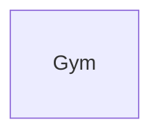

# Technical Design Document

## 1. Document Control
- **Version:** 1.0
- **Authors:** Henry Huerta, Jared Cordova
- **Date:** 9/17/25
- **Reviewers:**  Prof. Arnold Lau, T.A. Sneh Bhandari

## 2. Introduction
This TDD specifies the technical implementation details for the Gym Membership Management System (“FitDB”). The design emphasizes the database layer: RBAC (SQL roles), auditable transactions, and denormalized reporting views.

(See [`README.md`](./docs/README.md) for MVP and roadmap.)

## 3. High‑Level Architecture
- Auth/RBAC, Membership, Scheduling, Equipment, Reporting, Audit.
- MySQL as the system of record
- Static assets and member photos stored locally in dev

(create visual diagram)

## 4. Detailed Design

### 4.1 Data Model
**ER Diagram (WIP)**

**Key Tables (summary) (WIP)**

**Constraints & Indexes (WIP)**
- unique usernames and emails for members
- unique bookings
- indexes:? (?)

### 4.2 API Design
(?)

### 4.3 Application Logic
**Booking Workflow (transactional)**
1. verify role = `plus_member`; session is `scheduled` and within bookable window
2. capacity check + equipment sufficiency (per-attendee requirements × seats)
3. insert `Booking`; write `AuditLog`; commit or rollback on any failure

**Publish Sessions (manager)**
1. expand `TrainerAvailability` into sessions for date range
2. validate conflicts and equipment availability; create `ClassSession` rows; write audit in a single transaction

**Check-In**
- validate active membership; insert `CheckIn`; write audit

**RBAC Mapping (selected)**
- `member`: read-only sessions, own profile/check-ins
- `plus_member`: `member` + create/cancel own bookings
- `trainer`: manage own availability; view rosters
- `manager`: publish sessions; manage equipment; view any roster
- `front_desk`: check-ins only; read-only member status
- `admin`: all privileges

### 4.4 User Interface (server-rendered MVP)
- **Member (regular):** profile + check-ins; sessions list (read-only)
- **Plus Member:** sessions list → details → confirm booking/cancel
- **Trainer:** “My Availability” editor; “My Sessions” roster.
- **Manager:** “Publish Sessions” wizard; “Equipment” dashboard; conflicts queue
- **Admin:** audit viewer + role assignments

## 5. Technology Stack
- **Backend:** Python + Flask
- **Database:** MySQL
- **Frontend:** HTML/CSS (for now)

## 6. Security & Compliance
- Password hashing (?)
- **MySQL roles** with least-privilege grants; `plus_member` inherits from `member`
- **Audit logging** via DB triggers
- Parameterized queries only (?)

## 7. Performance Considerations
- Provide `build.sql` and seed data (?)
- Capture EXPLAIN/ANALYZE for: session listing, booking insert path, utilization/equipment views
- Paginate audit and reports

## 8. Risks & Mitigations
- **Overbooking or equipment conflicts** → DB trigger + transaction checks
- **RBAC misconfiguration** → explicit role grants
- **ERD conflicts** → ERD reviews
- **Scope considerations** → enforce MVP

## 9. Testing Strategy
- **Unit tests:** booking constraints, session publish logic, RBAC decorators
- **Integration tests:** transaction rollbacks on forced failures; seed users/roles
- **SQL tests:** views return expected utilization/equipment demand

## 10. Deployment & Monitoring
- **Runtime logging:** audit stored in DB (as JSON?)
- **Metrics:** latency, error rates, booking success/failure counts
- **Backups:** do DB snapshots/backups (?)